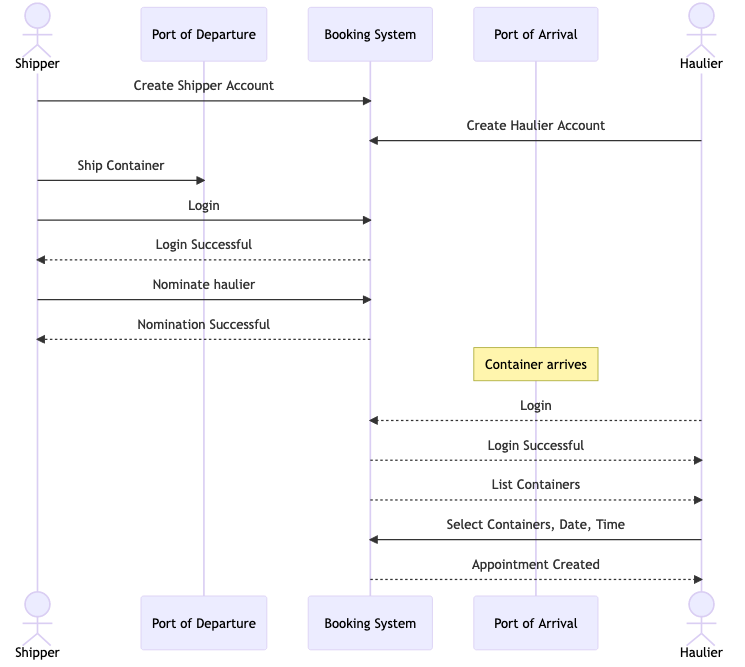
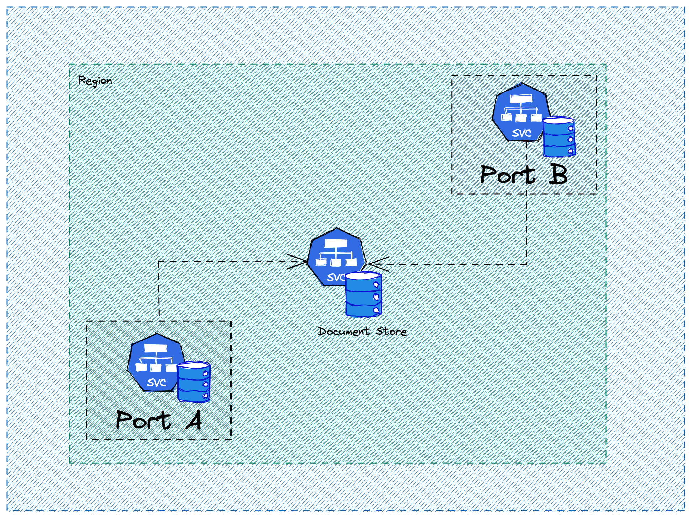
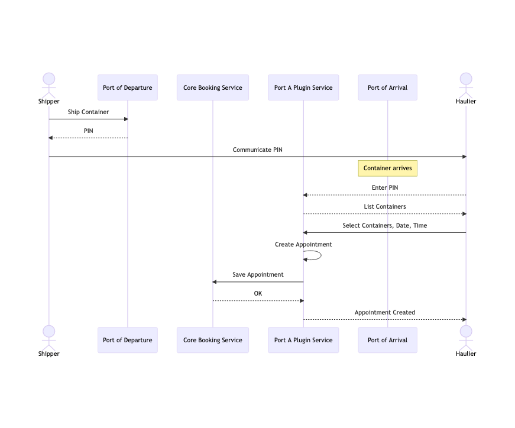

# Case Study: Distributed Microkernal Architecture

## Introduction

We were contracted to build a booking system that enabled hauliers (truckers) to pick up containers assigned to them from a sea port.

The tricky bit was that the contracting company operated a number of ports, and for legacy reasons, different ports had different strategies to assign a container to be picked up by a particular haulier.

Let me explain this with an example; we'll consider two sea ports: A and B.

In Port A, when a shipper ships a container, they receive a PIN code that they pass on to the haulier. The haulier then logs on to the booking system, enters the PIN, is able to see the container and book a time slot to pick it up.

In Port B, the shipper and haulier must both be registered on the platform. The shipper designates the haulier by entering their username.

In whatever way containers were assigned to hauliers, an booking had to be created in the backend so that it could be verified at the port gate.

## High Level Solution

The solution that I had in mind was that we would have a "core" booking microservice which was only concerned with who's picking up which containers and when. This service offered a consolidated view of all bookings.

We would then have any number of "plugin" microservices for each port. These plugin microservices would implement the way hauliers are nominated at that particular port and then pass the necessary details on to the core booking service.

The architecture is illustrated in the diagram below:

The Core system would use a Document Store (e.g. MongoDB) since different nomination systems at different ports meant the attributes that needed to be stored varied.

The Sequence diagram of creating a booking in Port A would then look something like this:

## Outcome

Was this proposal implemented? Nope!

I did share this proposal with the senior architect who responded very positively to it and asked me to document the finer details.

However, at the time, I had never heard of the "Microkernel" or "Plugin" Architecture and I thought this was a novel solution to the problem; that made me nervous. I had a habit of second-guessing myself so I didn't pursue the idea further.

In retrospect, I wish I had. No solution is perfect, but I think the key thing about this solution was that it was relatively easy to understand and maintain. I also think I ought to have discussed the idea with other members of the team; I'm sure that if anyone of them had mentioned that this architecture has a name, it would have given me a lot more confidence.