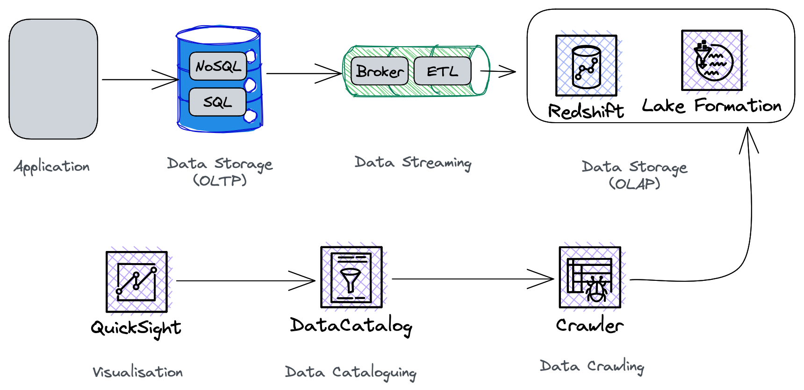

# Data Transformation Day (AWS)

I recently added a seminar hosted by AWS called "Data Transformation Day". These are my notes on the event.

--- 

## Introduction

- 90% of the data that was ever existed was generated in the last 2 years (most of it, just useless selfies, I bet)

- 32% of companies agreed that they were able to derive benefit from their data.

- The goal of this talk is to show how AWS can enable you to store, analyse, query and visualise your data. AWS makes it easy and cost-effective.

## Data Flow

## Storing Data

### Aurora
- MySQL/Postgres compatible database (no vendor lock-in)
- Enhanced performance for 2 main reasons:
	- Page size increased to 16KB so writes can be written directly to storage (no need of double buffers)
	- Storage is in replicated cloud storage
- Serverless version available.

### DynamoDB
- The biggest impact of NoSQL in the tech industry is that whereas before you had to figure out how to map your application's data to a relational structures (impedence mismatch), now you have to look at your use-case and figure out which storage engine best fits your needs.
- [**Single table design**](https://aws.amazon.com/blogs/compute/creating-a-single-table-design-with-amazon-dynamodb/) 1 application has one table (or you could say, 1 microservice = 1 table)
- DynamoDB removes the burden figuring out how many servers and partitions you need on the DB admin and architect; you just need to know your anticipated read/write workload and DynamoDB will figure out how to handle it.
- Modelling:
	- Understand the use-case (Nature of the data: OLTP, OLAP, Full Text, Relationship between entities, What does concurrent access look like, Time series, Archiving needs)
	- Identify the access patterns (Read workload, write workload, Query aggregations & KPIs
	- Data Modelling using NoSql Design Patterns (Single Table Design, Identify Partition Key = Primary + Sort Key)
 	- Review, Repeat, Review: Modelling your data on any NoSQL db is tricky, and likely needs to evolve with time. It’s important to monitor the how your data is read and written by your applications and review if your data model can be improved to further optimise the process.

## Data Democratization
- Make data accessible and understandable to a wider range of people within an organization, so that they can make better decisions.
- For fintechs, this means better risk management.

## Querying Data

###  AWS Kendra
- Natural language queries on your enterprise's data e.g. Forecasting

## Visualisation

### AWS Quicksight

- Enables you to make data dashboards (e.g. heat maps of customers as they move around a store)
- Provide execute summaries / action items based on the data 

## Cost Effectiveness

### Serverless
- Amazon is investing heavily in serverless: they're offering offering serverless versions of their existing services, including Aurora, Quicksight and OpenSearch.
- A number of people I spoke to, and a number of people in the audience spoke about how they migrated to Serverless.
- Serverless enables companies to migrate from a CapEx model to a OpEX model.
- One of the speakers described how he believes the industry is moving towards cloud functions connected by data streams.

## Q & A

**Sharding**

- Recommended using [Vitess](https://vitess.io/docs/15.0/reference/features/sharding/) to manage sharding on the cloud in production. Used by several companies with millions of DAUs.
- To identify when you need to shard, monitor the average latency of your queries cross-referenced with the size of your database. 
- When this metric goes beyond your SLA, consider sharding.

**Modelling transaction data on DynamoDB**

- Discussed the idea of using a composite key consisting of the AccountID, Year, and Month as the partition key, and either Timestamp or a Transaction ID as the sorting key to efficiently store and retrieve transaction data in DynamoDB. 

- He agreed with it, said not to worry that there would be too many partitions because they're divided among available nodes.

