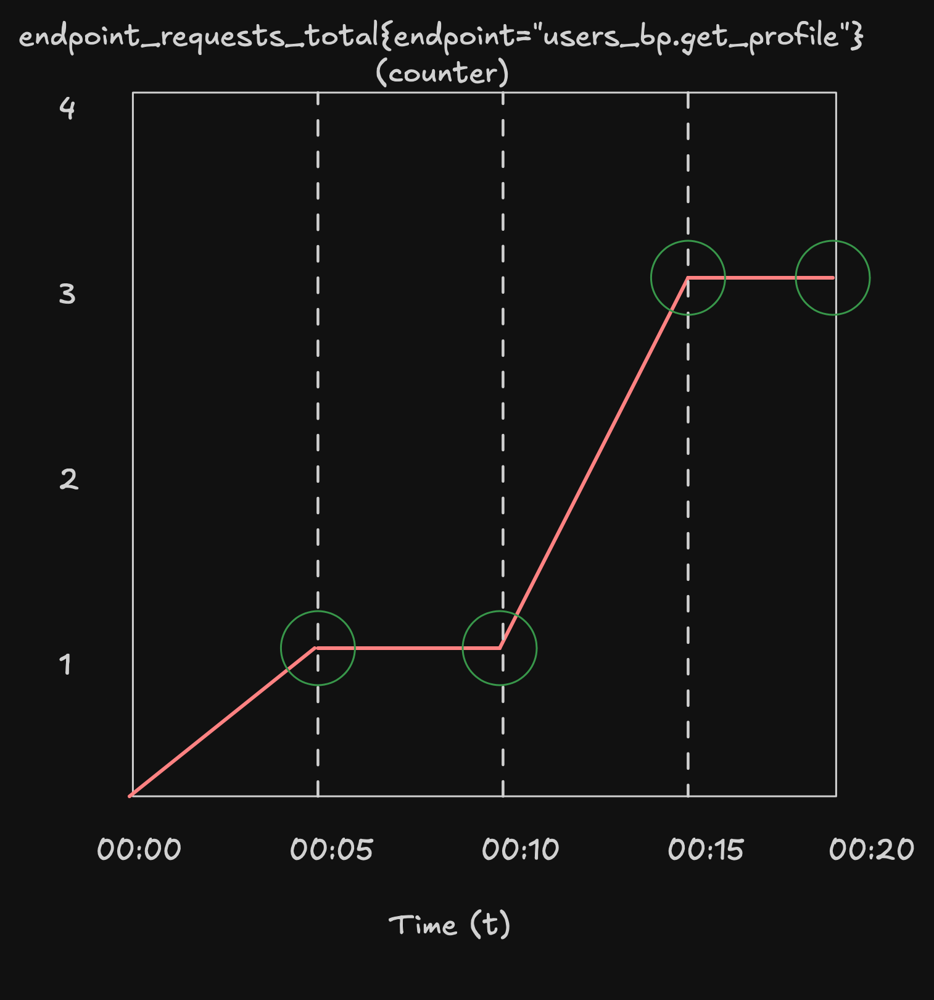

# PromQL

##  Flask OpenTelemetry Setup
       
*app.py*
```python
from instrument_app import setup_logging, create_app

# If the application is launched using the gunicorn app:app command,
# then gunicorn will load the app module (app.py) and look for the app variable.
# (Note: the name of the module is on the left of the colon, and the name of the variable is on the right)
# Since the app module is loaded, __name__ will be set to `app` rather than __main__.
if __name__ == "app":
    setup_logging()
    # Gunicorn is looking for this `app` variable. Do not remove or discard this assignment.
    app = create_app()
```

*instrument_app/app.py*
```python
import os
import time
from flask import Flask, request, request_started, request_finished
from opentelemetry import trace, metrics
from opentelemetry._logs import set_logger_provider
from opentelemetry.sdk.trace import TracerProvider
from opentelemetry.sdk.trace.export import BatchSpanProcessor
from opentelemetry.exporter.otlp.proto.http.trace_exporter import OTLPSpanExporter
from opentelemetry.sdk.metrics import MeterProvider
from opentelemetry.sdk.metrics.export import PeriodicExportingMetricReader
from opentelemetry.exporter.otlp.proto.http.metric_exporter import OTLPMetricExporter
from opentelemetry.exporter.otlp.proto.http._log_exporter import OTLPLogExporter
from opentelemetry.sdk._logs import LoggerProvider, LoggingHandler
from opentelemetry.sdk._logs.export import BatchLogRecordProcessor
from opentelemetry.instrumentation.flask import FlaskInstrumentor
from opentelemetry.sdk.resources import Resource

meter = metrics.get_meter("flask_app_metrics")

# Create metrics instruments
endpoint_request_counter = meter.create_counter(
    name="endpoint_requests_total",
    description="Total number of requests per endpoint",
    unit="1",
)

http_status_counter = meter.create_counter(
    name="http_status_codes_total",
    description="Total number of HTTP status codes",
    unit="1",
)

http_duration_histogram = meter.create_histogram(
    name="http_request_duration_seconds",
    description="HTTP request duration in seconds",
    unit="s",
)

def setup_logging(testing=False):
    # recreate_defaults() must be called at the beginning of this function, otherwise structlog will not be sent to opentelemetry.
    # recreate_defaults() sends structlogs through python standard logging and Opentelemetry is configured to read from standard logging.
    default_processors = recreate_defaults() or []
    processors = default_processors + [
        structlog.contextvars.merge_contextvars,
        structlog.processors.add_log_level,
        structlog.processors.TimeStamper(fmt="iso"),
        structlog.processors.dict_tracebacks,
        structlog.processors.JSONRenderer(),
    ]
    structlog.configure(processors=processors)

def create_app():
    app = Flask(
        __name__,
        instance_relative_config=True,
    )

    environment = os.environ.get("FLASK_ENV", "development")

    app.config.from_object("config")
    app.config.from_pyfile(f"config-{environment.lower()}.py")

    _setup_instrumentation(app)
    _register_blueprints(app)

    request_started.connect(bind_request_details, app)
    request_finished.connect(bind_request_finished, app)

    return app

def bind_request_details(sender, **extras):
    if request:
        request.start_time = time.time()


def bind_request_finished(sender, response, **extras):
    endpoint = request.endpoint if request.endpoint else request.path
    method = request.method
    status_code = response.status_code

    # Calculate duration
    duration = time.time() - request.start_time

    # Record metrics with appropriate labels/attributes
    endpoint_request_counter.add(1, {"endpoint": endpoint})
    http_status_counter.add(1, {"status_code": str(status_code), "endpoint": endpoint})
    http_duration_histogram.record(duration, {"method": method, "endpoint": endpoint})


def _setup_instrumentation(app):
    # Each gunicorn worker will have its own counter.
    # For the sake of simplicity, we will append the pid to the instance id to distinguish the counter of each worker.
    # https://github.com/open-telemetry/opentelemetry-python/issues/3885
    #
    # In a multi-process Flask application, you could use the process_id as the instance.id to distinguish between counters with the same name.
    # However, If you preload the app, you must set the instance.id after preloading the app.
    # If you set the instance.id before preloading, the instance.id set on the resource will be the same for all processes.
    # If you set the instance.id after preloading, the instance.id set on the resource will be different for each process.
    resource = Resource.create(
        {
            "service.name": os.getenv("OTEL_SERVICE_NAME", "my-api"),
            "service.instance.id": f"{_get_server_id()}:{os.getpid()}",
        }
    )

    trace_provider = TracerProvider(resource=resource)
    trace.set_tracer_provider(trace_provider)

    otlp_trace_exporter = OTLPSpanExporter()
    trace_provider.add_span_processor(BatchSpanProcessor(otlp_trace_exporter))

    metric_reader = PeriodicExportingMetricReader(OTLPMetricExporter())
    metric_provider = MeterProvider(resource=resource, metric_readers=[metric_reader])
    opentelemetry.metrics.set_meter_provider(metric_provider)

    # https://docs.honeycomb.io/send-data/logs/opentelemetry/sdk/python/
    logger_provider = LoggerProvider(resource=resource)
    set_logger_provider(logger_provider)

    otlp_log_exporter = OTLPLogExporter()
    logger_provider.add_log_record_processor(BatchLogRecordProcessor(otlp_log_exporter))

    handler = LoggingHandler(level=logging.INFO)

    root_logger = logging.getLogger()
    root_logger.addHandler(handler)

    FlaskInstrumentor().instrument_app(app)
```

## 1. Counters

- A counter's value only increments. 

- Decrecments can occur when the counter is reset. Typically if the node restarts.

- You may see also decrements when the service has multiple replicas using the same counter name. The counter will have a different value in each  replica. For example:
    - Node A. Counter 'A' = 5
    - Node B. Counter 'A' = 1

- You can distinguish between counters on different replicas by `setting instance.id` 

- For a forked processes such as a Flask application running on gunicorn, you could use the process_id as the `instance.id` to distinguish between counters with the same name.

- However, the instance id must be set after the process is forked. Otherwise the `instance.id` set on the resource will be the same on all processes. 



### 1.1 `increase`

- Given a counter with value `v`, the increase `Δv` is: 

`Δv = v[t2] - v[t2-Δt]`

- For example:
    - At 12:00, value is is 10
    - 10 minutes later, the value is 12; 
    - The increase over 10m is 2. 
    - `increase(counter{name="value"}[10m])`


## Rate

- Rate is the rate of increase of the value.

- `Rate = Δv/Δt` where t is in seconds.

- For example:
    - At 12:00, value is is 10
    - 10 minutes later, the value is 12; 
    - The rate over 10m is 0.003. 
    - `rate(counter{name="value"}[10m]) = 0.003`

